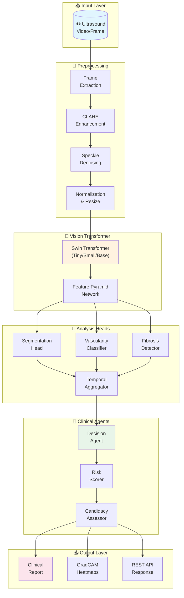
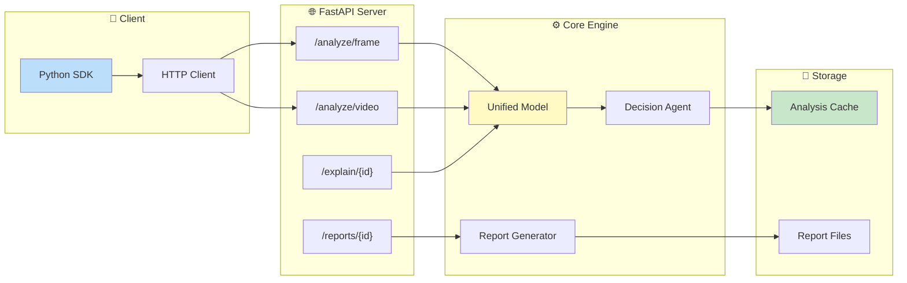
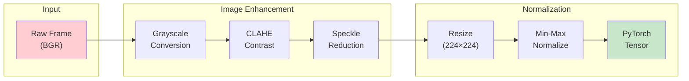
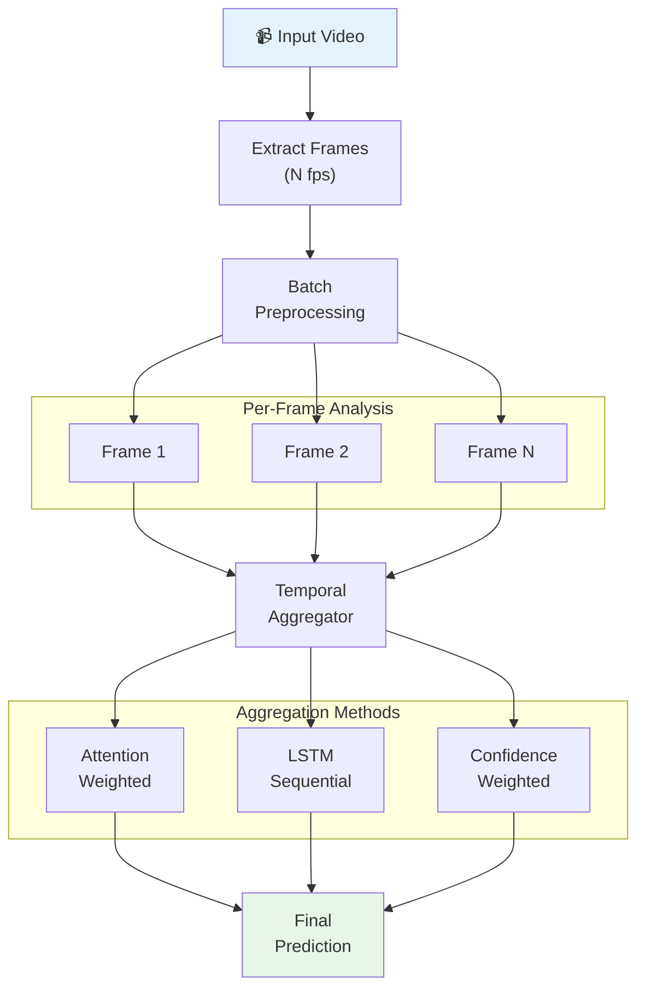
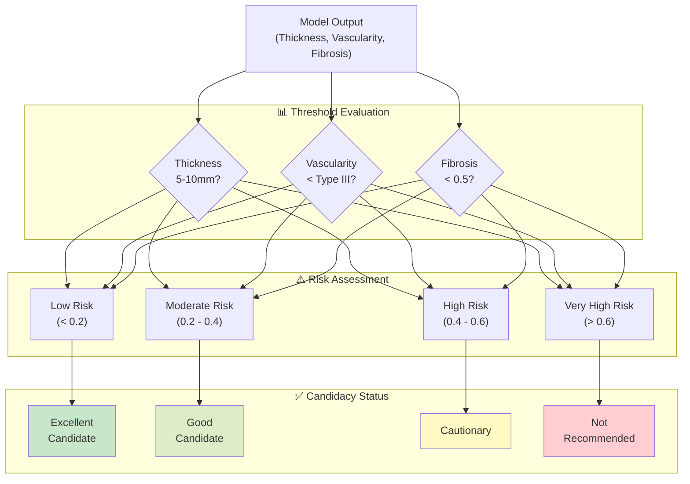

# 🔬 UterusScope-AI

**Autonomous Ultrasound Interpretation Agent for Endometrial Analysis**

[](https://www.python.org/downloads/)
[](https://opensource.org/licenses/MIT)
[](https://monai.io/)
[](https://pytorch.org/)
[](https://fastapi.tiangolo.com/)

> ⚠️ **Medical Disclaimer**: This system is a clinical decision support tool designed to assist healthcare professionals. It is NOT intended to replace professional medical judgment. All outputs require review by qualified clinicians before any clinical decisions are made.

---

## 📋 Table of Contents

- [Overview](#-overview)
- [Key Features](#-key-features)
- [System Architecture](#-system-architecture)
- [Processing Pipeline](#-processing-pipeline)
- [AI Models](#-ai-models)
- [Clinical Decision Flow](#-clinical-decision-flow)
- [Quick Start](#-quick-start)
- [API Reference](#-api-reference)
- [Project Structure](#-project-structure)
- [Clinical Thresholds](#-clinical-thresholds)
- [Configuration](#-configuration)
- [Testing](#-testing)
- [License & Disclaimer](#-license--disclaimer)

---

## 🎯 Overview

UterusScope-AI is an open-source autonomous agent that analyzes transvaginal ultrasound videos to assess:

| Analysis | Description | Output |
|----------|-------------|--------|
| 📏 **Endometrial Thickness** | Precise measurement with segmentation | Millimeters (mm) |
| 🩸 **Vascularity Patterns** | Blood flow classification | Types 0-III |
| 🔬 **Fibrosis Risk** | Scar pattern detection | Risk score (0-1) |

The system assists in **UG-IHI (Uterine Gel-based Intrauterine Hydrogel Infusion)** candidacy decisions by providing **explainable, clinician-readable reports** with GradCAM heatmaps.

---

## ✨ Key Features

```
┌─────────────────────────────────────────────────────────────────────────┐
│                         UterusScope-AI Features                          │
├──────────────────┬──────────────────┬───────────────────┬───────────────┤
│   🧠 AI Models   │  📊 Explainability │   🔌 Integration  │  📋 Reports  │
├──────────────────┼──────────────────┼───────────────────┼───────────────┤
│ Swin Transformer │ GradCAM++ Maps   │ REST API          │ HTML/PDF      │
│ Multi-task Heads │ Attention Viz    │ Python SDK        │ Heatmaps      │
│ Video Temporal   │ Rollout Analysis │ ONNX Export       │ Candidacy     │
│ MONAI Pipeline   │ Per-head Explain │ CORS Support      │ Risk Scores   │
└──────────────────┴──────────────────┴───────────────────┴───────────────┘
```

---

## 🏗️ System Architecture

### High-Level Architecture



### Component Interaction Diagram



---

## 🔄 Processing Pipeline

### Frame Processing Workflow



### Video Analysis Pipeline



---

## 🧠 AI Models

### Model Architecture Overview

```
┌────────────────────────────────────────────────────────────────────────────┐
│                           UterusScopeModel                                  │
├────────────────────────────────────────────────────────────────────────────┤
│                                                                             │
│  ┌─────────────────────────────────────────────────────────────────────┐   │
│  │                    Swin Transformer Backbone                         │   │
│  │  ┌───────────┐   ┌───────────┐   ┌───────────┐   ┌───────────┐      │   │
│  │  │  Stage 1  │──▶│  Stage 2  │──▶│  Stage 3  │──▶│  Stage 4  │      │   │
│  │  │  96 ch    │   │  192 ch   │   │  384 ch   │   │  768 ch   │      │   │
│  │  │  56×56    │   │  28×28    │   │  14×14    │   │  7×7      │      │   │
│  │  └───────────┘   └───────────┘   └───────────┘   └───────────┘      │   │
│  └─────────────────────────────────────────────────────────────────────┘   │
│                                    │                                        │
│           ┌────────────────────────┼────────────────────────┐              │
│           │                        │                        │              │
│           ▼                        ▼                        ▼              │
│  ┌─────────────────┐     ┌─────────────────┐     ┌─────────────────┐      │
│  │   Segmentation  │     │   Vascularity   │     │    Fibrosis     │      │
│  │      Head       │     │    Classifier   │     │    Detector     │      │
│  ├─────────────────┤     ├─────────────────┤     ├─────────────────┤      │
│  │ U-Net Decoder   │     │ Attention Pool  │     │ Spatial Attn    │      │
│  │ Thickness Est.  │     │ 4-class Output  │     │ Severity Score  │      │
│  │ Binary Mask     │     │ Confidence      │     │ Probability Map │      │
│  └─────────────────┘     └─────────────────┘     └─────────────────┘      │
│                                                                             │
└────────────────────────────────────────────────────────────────────────────┘
```

### Model Specifications

| Component | Architecture | Parameters | Output |
|-----------|--------------|------------|--------|
| **Backbone** | Swin-Tiny | ~28M | Multi-scale features |
| **Segmentation** | U-Net Decoder | ~5M | 224×224 mask + thickness |
| **Vascularity** | Attention Pooling + MLP | ~1M | 4 classes + confidence |
| **Fibrosis** | Spatial Attention + Conv | ~2M | Probability map + score |
| **Temporal** | Multi-head Attention | ~0.5M | Aggregated features |

### Swin Transformer Variants

```
┌─────────────────┬────────────┬─────────────┬────────────┬──────────────┐
│     Variant     │ Embed Dim  │   Depths    │   Heads    │   Params     │
├─────────────────┼────────────┼─────────────┼────────────┼──────────────┤
│   Swin-Tiny     │     96     │ [2,2,6,2]   │ [3,6,12,24]│    ~28M      │
│   Swin-Small    │     96     │ [2,2,18,2]  │ [3,6,12,24]│    ~50M      │
│   Swin-Base     │    128     │ [2,2,18,2]  │ [4,8,16,32]│    ~88M      │
└─────────────────┴────────────┴─────────────┴────────────┴──────────────┘
```

---

## 🏥 Clinical Decision Flow

### Decision Agent Workflow



### Risk Scoring Formula

```
┌────────────────────────────────────────────────────────────────────────┐
│                        Risk Score Calculation                           │
├────────────────────────────────────────────────────────────────────────┤
│                                                                         │
│   Total Risk = Σ (Factor Weight × Factor Score)                        │
│                                                                         │
│   ┌────────────────────┬────────────┬─────────────────────────────┐    │
│   │      Factor        │   Weight   │        Score Range          │    │
│   ├────────────────────┼────────────┼─────────────────────────────┤    │
│   │ Thickness Risk     │    25%     │ 0 (normal) → 1 (extreme)    │    │
│   │ Vascularity Risk   │    25%     │ Type × 0.3 (max 0.9)        │    │
│   │ Fibrosis Risk      │    30%     │ Score × 1.5 (max 1.0)       │    │
│   │ Image Quality      │    10%     │ 1 - quality score           │    │
│   │ Patient Factors    │    10%     │ Age, history based          │    │
│   └────────────────────┴────────────┴─────────────────────────────┘    │
│                                                                         │
└────────────────────────────────────────────────────────────────────────┘
```

---

## 🚀 Quick Start

### Installation

```bash
# Clone the repository
git clone https://github.com/uterus-scope-ai/uterus-scope-ai.git
cd uterus-scope-ai

# Create virtual environment
python -m venv venv
source venv/bin/activate  # On Windows: venv\Scripts\activate

# Install package with all dependencies
pip install -e ".[dev]"
```

### Generate Synthetic Test Data

```bash
# Generate 50 synthetic ultrasound samples
python scripts/generate_synthetic.py --count 50 --output ./data/synthetic

# Generate with video sequences
python scripts/generate_synthetic.py --count 20 --videos --frames 30
```

### Start the API Server

```bash
# Development mode with auto-reload
uvicorn api.main:app --reload --host 0.0.0.0 --port 8000

# Production mode
uvicorn api.main:app --host 0.0.0.0 --port 8000 --workers 4
```

### Using the Python SDK

```python
from uterus_scope import UterusScopeClient

# Initialize client
client = UterusScopeClient(api_url="http://localhost:8000")

# Health check
status = client.health_check()
print(f"API Status: {status['status']}")

# Analyze single frame
result = client.analyze_frame("ultrasound_frame.png")
print(f"""
╔═══════════════════════════════════════════════════════╗
║              UterusScope-AI Analysis                  ║
╠═══════════════════════════════════════════════════════╣
║  Endometrial Thickness: {result.endometrial_thickness:>6.1f} mm                ║
║  Vascularity Type:      {result.vascularity_name:<24} ║
║  Fibrosis Score:        {result.fibrosis_score:>6.2f}                     ║
║  Confidence:            {result.candidacy_confidence:>6.1%}                    ║
╠═══════════════════════════════════════════════════════╣
║  Candidacy: {result.candidacy:<41} ║
╚═══════════════════════════════════════════════════════╝
""")

# Generate PDF report
report_path = client.generate_report(result.analysis_id, format="pdf")
print(f"Report saved to: {report_path}")

# Get explainability heatmaps
heatmaps = client.get_heatmaps(result.analysis_id)
for name, image_bytes in heatmaps.items():
    with open(f"heatmap_{name}.png", "wb") as f:
        f.write(image_bytes)
```

### Direct Model Usage

```python
import torch
from uterus_scope import get_model, get_config
from uterus_scope.data.preprocessing import UltrasoundPreprocessor

# Load model
Model = get_model()
model = Model(pretrained=True)
model.eval()

# Preprocess image
preprocessor = UltrasoundPreprocessor()
tensor = preprocessor.preprocess_frame(image)

# Run inference
with torch.no_grad():
    output = model(tensor.unsqueeze(0))

print(f"Thickness: {output.segmentation.thickness_mm[0]:.1f}mm")
print(f"Vascularity: Type {output.vascularity.predicted_type[0]}")
print(f"Fibrosis: {output.fibrosis.severity_score[0]:.2f}")
```

---

## 🔌 API Reference

### Endpoints Overview

```
┌─────────────────────────────────────────────────────────────────────────┐
│                          API Endpoints                                   │
├──────────────────────────┬─────────┬────────────────────────────────────┤
│        Endpoint          │ Method  │          Description               │
├──────────────────────────┼─────────┼────────────────────────────────────┤
│ /                        │  GET    │ Root info & health                 │
│ /api/v1/health           │  GET    │ Health check with model status     │
│ /api/v1/analyze/frame    │  POST   │ Analyze single ultrasound frame    │
│ /api/v1/analyze/video    │  POST   │ Analyze ultrasound video           │
│ /api/v1/reports/{id}     │  GET    │ Generate HTML/PDF report           │
│ /api/v1/explain/{id}     │  POST   │ Get GradCAM heatmaps               │
└──────────────────────────┴─────────┴────────────────────────────────────┘
```

### Request/Response Examples

#### Analyze Frame

```bash
curl -X POST "http://localhost:8000/api/v1/analyze/frame" \
  -H "Content-Type: multipart/form-data" \
  -F "file=@ultrasound.png"
```

**Response:**
```json
{
  "analysis_id": "a1b2c3d4",
  "endometrial_thickness_mm": 7.5,
  "vascularity_type": 1,
  "vascularity_confidence": 0.92,
  "fibrosis_score": 0.15,
  "candidacy": "excellent_candidate",
  "candidacy_confidence": 0.89,
  "summary": "Patient appears to be an excellent candidate for UG-IHI therapy.",
  "alerts": []
}
```

#### Get Report

```bash
curl "http://localhost:8000/api/v1/reports/a1b2c3d4?format=pdf" \
  --output report.pdf
```

---

## 📁 Project Structure

```
uterus-scope-ai/
├── 📄 pyproject.toml              # Project configuration & dependencies
├── 📄 README.md                   # This documentation
├── 📄 .env.example               # Environment configuration template
│
├── 📁 api/                        # FastAPI REST API
│   ├── 📄 main.py                # Application & endpoints
│   └── 📁 schemas/               # Pydantic models
│       ├── 📄 requests.py        # Request schemas
│       └── 📄 responses.py       # Response schemas
│
├── 📁 scripts/                    # Utility scripts
│   ├── 📄 generate_synthetic.py  # Synthetic data generation
│   └── 📄 export_onnx.py         # ONNX model export
│
├── 📁 src/uterus_scope/           # Main Python package
│   ├── 📄 __init__.py            # Package exports
│   ├── 📄 config.py              # Configuration management
│   │
│   ├── 📁 data/                  # Data pipeline
│   │   ├── 📄 preprocessing.py   # CLAHE, denoising, normalization
│   │   ├── 📄 synthetic.py       # Synthetic ultrasound generator
│   │   ├── 📄 augmentation.py    # MONAI transforms
│   │   └── 📄 dataset.py         # PyTorch datasets
│   │
│   ├── 📁 models/                # AI Models
│   │   ├── 📄 backbone.py        # Swin Transformer
│   │   ├── 📄 segmentation.py    # Endometrial segmentation
│   │   ├── 📄 vascularity.py     # Blood flow classifier
│   │   ├── 📄 fibrosis.py        # Scar pattern detector
│   │   ├── 📄 temporal.py        # Video frame aggregation
│   │   └── 📄 unified.py         # Combined model
│   │
│   ├── 📁 agents/                # Clinical Decision
│   │   ├── 📄 decision.py        # Main decision agent
│   │   ├── 📄 risk_scorer.py     # Risk calculation
│   │   └── 📄 candidacy.py       # UG-IHI candidacy
│   │
│   ├── 📁 explainability/        # Model Explainability
│   │   ├── 📄 gradcam.py         # GradCAM++ implementation
│   │   └── 📄 attention.py       # Attention visualization
│   │
│   ├── 📁 reports/               # Clinical Reports
│   │   └── 📄 generator.py       # HTML/PDF generation
│   │
│   └── 📁 sdk/                   # Python SDK
│       └── 📄 client.py          # API client
│
└── 📁 tests/                      # Test Suite
    ├── 📄 test_preprocessing.py  # Data pipeline tests
    ├── 📄 test_models.py         # Model architecture tests
    ├── 📄 test_agents.py         # Clinical agent tests
    └── 📄 test_api.py            # API endpoint tests
```

---

## 📊 Clinical Thresholds

### Endometrial Thickness

```
                    Thickness Scale (mm)
    ├─────────┬─────────────────────────┬────────────┤
    0         5                        10           15+
    │  THIN   │        NORMAL          │   THICK    │
    │ ⚠️ Alert│          ✅             │  ⚠️ Alert  │
    └─────────┴─────────────────────────┴────────────┘
```

### Vascularity Types

| Type | Name | Description | Risk Level |
|------|------|-------------|------------|
| **0** | Avascular | No detectable blood flow | ⚠️ Attention |
| **I** | Minimal | Sparse vessels, low flow | ✅ Normal |
| **II** | Moderate | Moderate vasculature | ✅ Normal |
| **III** | High | Dense vessels, high flow | ⚠️ Alert |

### Candidacy Status

| Status | Risk Score | Recommendation |
|--------|------------|----------------|
| 🟢 **Excellent Candidate** | < 0.15 | Proceed with standard protocol |
| 🟡 **Good Candidate** | 0.15 - 0.30 | Proceed with monitoring |
| 🟠 **Cautionary** | 0.30 - 0.50 | Additional evaluation recommended |
| 🔴 **Not Recommended** | > 0.50 | Consider alternative treatments |

---

## ⚙️ Configuration

### Environment Variables

Create a `.env` file in the project root:

```env
# ═══════════════════════════════════════════════════════════
#                    MODEL CONFIGURATION
# ═══════════════════════════════════════════════════════════
MODEL_BACKBONE=swin_tiny          # swin_tiny, swin_small, swin_base
PRETRAINED_WEIGHTS=imagenet       # imagenet, none, /path/to/checkpoint
DEVICE=cuda                       # cuda, cpu

# ═══════════════════════════════════════════════════════════
#                   PROCESSING SETTINGS
# ═══════════════════════════════════════════════════════════
INPUT_SIZE=224                    # Input image size (square)
VIDEO_FPS=5                       # Frames per second for video
MAX_VIDEO_FRAMES=100              # Maximum frames to process

# ═══════════════════════════════════════════════════════════
#                      API SETTINGS
# ═══════════════════════════════════════════════════════════
API_HOST=0.0.0.0
API_PORT=8000
CORS_ORIGINS=["*"]

# ═══════════════════════════════════════════════════════════
#                    REPORT SETTINGS
# ═══════════════════════════════════════════════════════════
REPORT_OUTPUT_DIR=./reports
REPORT_FORMAT=html                # html, pdf, both

# ═══════════════════════════════════════════════════════════
#                  CLINICAL THRESHOLDS
# ═══════════════════════════════════════════════════════════
THICKNESS_MIN_NORMAL=5.0
THICKNESS_MAX_NORMAL=10.0
THICKNESS_ALERT_HIGH=12.0
VASCULARITY_ALERT_THRESHOLD=3
FIBROSIS_ALERT_THRESHOLD=0.5
```

---

## 🧪 Testing

```bash
# Run all tests
pytest tests/ -v

# Run with coverage report
pytest tests/ --cov=src/uterus_scope --cov-report=html

# Run specific test modules
pytest tests/test_models.py -v
pytest tests/test_agents.py -v

# Run tests matching pattern
pytest tests/ -k "vascularity" -v
```

### Test Coverage Goals

| Module | Target Coverage |
|--------|----------------|
| `data/` | > 80% |
| `models/` | > 75% |
| `agents/` | > 85% |
| `api/` | > 70% |

---

## 📄 License & Disclaimer

### License

This project is licensed under the MIT License - see the [LICENSE](LICENSE) file for details.

### Medical Disclaimer

> ⚠️ **IMPORTANT**: This software is provided for **research and educational purposes only**.
>
> - It has **NOT** been cleared or approved by any regulatory authority (FDA, CE, etc.) for clinical use
> - It is **NOT** intended to diagnose, treat, cure, or prevent any disease
> - All outputs **MUST** be reviewed by qualified healthcare professionals
> - Clinical decisions should **NEVER** be based solely on this software's outputs
> - The developers assume **NO** liability for clinical use of this software

---

## 🙏 Acknowledgments

| Library | Purpose |
|---------|---------|
| [MONAI](https://monai.io/) | Medical imaging transforms |
| [PyTorch](https://pytorch.org/) | Deep learning framework |
| [timm](https://github.com/huggingface/pytorch-image-models) | Vision Transformer models |
| [FastAPI](https://fastapi.tiangolo.com/) | REST API framework |
| [WeasyPrint](https://weasyprint.org/) | PDF generation |

---

<div align="center">

**Made with ❤️ for advancing women's health**

[Report Bug](https://github.com/uterus-scope-ai/uterus-scope-ai/issues) · [Request Feature](https://github.com/uterus-scope-ai/uterus-scope-ai/issues) · [Documentation](https://uterus-scope-ai.readthedocs.io)

</div>
